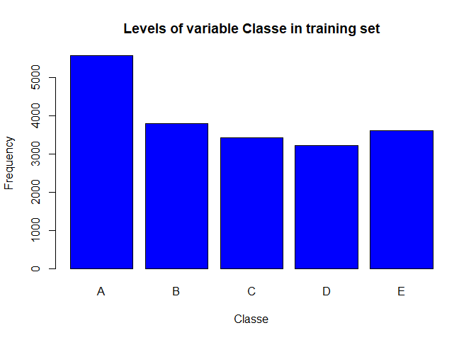
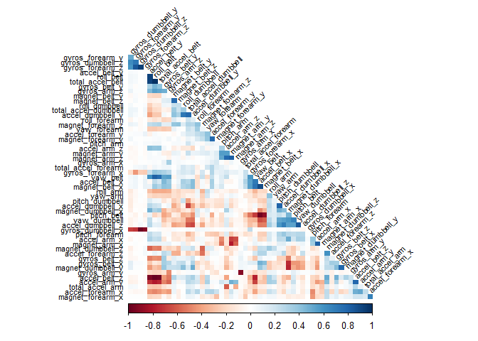
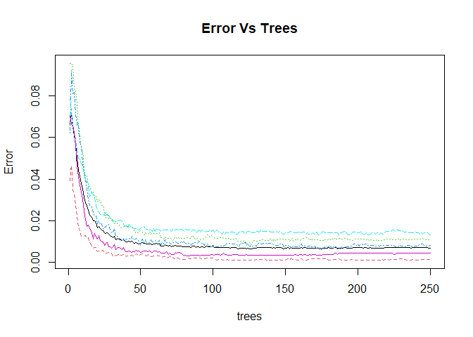

## Abstract

We predict the exercise doing behavior pattern of people based on the data collected from the accelerometers. We build the Random Forest model to predict the manner in which people do exercise, and the model successfully predict the behavior pattern with 99.41% accuracy.


## Background

With the help of gadgets like Fitbit, Nike FuelBand, and Jawbone Up, it's now reasonably cheap to gather a lot of data on an individual's activities. These kinds of gadgets are a component of the quantified self movement, which is a subset of enthusiasts that measure themselves on a regular basis for various reasons, such as being tech enthusiasts, to uncover patterns in their behavior, or to enhance their health. People frequently measure how much of a certain task they perform, but they hardly ever quantify how well they perform it. So, we will use the data from the accelerometers on the belt, forearm, arm, and dumbell of 6 participants who performs barbell lifts correctly or incorrectly in 5 different ways to predict the manner in which they do the exercise.

We will build the machine learning (ML) model with better accuracy and apply that model to predict the manner in which they did the exercise. From the data we will use the *classe* variable as the outcome variable and other remaining as the predictor variables in the training and test datasets. The data is available from the following sources:

The training data for this project are available here:

<https://d396qusza40orc.cloudfront.net/predmachlearn/pml-training.csv>

The test data are available here:

<https://d396qusza40orc.cloudfront.net/predmachlearn/pml-testing.csv>

More information on Human Activity Recognition (HAR) data can be obtained from here:

<http://web.archive.org/web/20161224072740/http:/groupware.les.inf.puc-rio.br/har>

## Data and Preprocessing

We will use the training and test data from the following sources, through which it is made available. First we will load the necessary libraries that is required to load, preprocess, and setup ML algorithms. Here we will use the  *dplyr*, *caret*, *corrplot*,  *randomForest* and *rpart* libraries.


```r
## Load the libraries into system memory and if not downloaded first download and load
packages <- c("dplyr", "caret", "randomForest", "rpart", "corrplot")
installed_packages <- packages %in% rownames(installed.packages())
if (any(installed_packages == FALSE)) {
        install.packages(packages[!installed_packages])
}
invisible(lapply(packages, library, character.only = TRUE))
```

#### 1. Download and load the data

Then we download and load the data into system memory for further data processign and analysis.


```r
dir_path <- getwd() ## Get the path of the current/working directory

## Create data url and download the data

data_url <- c(
        "https://d396qusza40orc.cloudfront.net/predmachlearn/pml-training.csv",
        "https://d396qusza40orc.cloudfront.net/predmachlearn/pml-testing.csv")

data_files <- c(
        "pml-training.csv",
        "pml-testing.csv")

for (i in seq_along(data_url)){
        
        if (!file.exists(data_files[i])){
                download.file(data_url[i], data_files[i])
                cat("File", data_files[i], "downloaded succesfully. \n")
        } else {
                cat("File", data_files[i], "already exists.")
        }
        
}
```

```
## File pml-training.csv downloaded succesfully. 
## File pml-testing.csv downloaded succesfully.
```

Let's load the training and test data to system memory and check the dimension of the training and test data.


```r
pml_training <- read.csv("pml-training.csv")
pml_testing <- read.csv("pml-testing.csv")

dim(pml_training)
```

```
## [1] 19622   160
```

```r
dim(pml_testing)
```

```
## [1]  20 160
```

We see that the training data has 19622 observations and 160 variables, while the testing data has 20 observations and 160 variables. We can check the first few rows of the data to understand the data structure and classes of the variables using the following code. However, since we have large number of rows and columns in training set, we will not show the output here.


```r
head(pml_training, 5)
str(pml_training)
```


#### 2. Cleaning the data and making it tidy

Here we will remove the redundant variables. Looking at the data, we see that we will not need the variable such as username, and time stamps. So we will remove the first 7 columns. Also, there are variables which contains many observations as **NA** and do not carry any useful information. So, we will remove all the columns which have more than 80% **NA** data.


```r
## Remove unwanted columns
df_train <- pml_training[, -c(1:7)]
df_test <- pml_testing[, -c(1:7)]

## Remove variables with more than 80% NA data
NAThreshold = dim(df_train)[1]*0.80
FunctKeepCol <- function(x){
        sum(is.na(x)) > NAThreshold || sum(x == "") > NAThreshold
}
keepCols <- !apply(df_train, 2, FunctKeepCol)

df_train <- df_train[, keepCols]
df_test <- df_test[, keepCols]
```


Now the tidy training dataset  contains 19622 observations and 53 variables.

## Exploratory Analysis

Since we are going to predict the manner in which the person did the exercise, stored in variable *classe*, we can check the different levels of the variable and make comparison between the different levels in the training dastaset.


```r
barplot(table(df_train$classe), col = "blue",
        xlab = "Classe", ylab = "Frequency",
        main = "Levels of variable Classe in training set")
```




From the above bar plot, we can see that the level A is most frequent with more than 5000 occurrences, whereas the other levels are within the same order of magnitude with more than 3000 occurrences.

We can also check for the variables in training dataset which are highly correlated amongst each other so that we can remove them from the training dataset. Later we will construct ML model for both the dataset: (1) including all variables and (2) excluding highly correlated variables.


```r
## Plot the correlation matrix
corrplot <- cor(df_train[, -length(names(df_train))])
corrplot(corrplot, method = "color", type = "lower", order = "hclust",
         tl.cex = 0.7, tl.col = "black", tl.srt = 45, diag = FALSE)
```




From the correlation matrix plot, we can see that some of the features are highly correlated with each other. We will exclude these highly correlated variables in one of our model.


```r
## Find the highly correlated variables and remove them
highCorrVar <- findCorrelation(corrplot, cutoff = 0.9, exact = TRUE)
df_trainHighCorrRemove <- df_train[, -highCorrVar]
df_testHighCorrRemove <- df_test[, -highCorrVar]
```

## Machine Learning Prediction Models

Since *Random Forest Model* is known for its high accuracy, we will employ it here. It also selects important variables automatically, and is also robust to correlated covariates and outliers. However, we also can test the *Random Forest Model* with other model.

#### 1. Cross validation

For the cross validation of the model, we will use the sub-sample from the training dataset as 70% for training and 30% for cross validation. The cross validataion daatset will be used to test on the training dataset and once the most accurate model is choosen it will be tested on the original testing dataset.


```r
set.seed(142)
trainIdx <- createDataPartition(df_train$classe, p = 0.7, list = FALSE)
train <- df_train[trainIdx, ]
validate <- df_train[-trainIdx, ]
```


#### 2. Predicting Models

##### (i). Model with all variables (Model1:modRf1)


```r
cvControl <- trainControl(method = "cv", number = 3, allowParallel = TRUE)

modRf1 <- train(classe~., data=train,
               method = "rf",
               trControl = cvControl,
               ntree=250)
```
               

The model *modRf1* works really well on the dataset. The final selected model has the accuracy of 0.9886438 and kappa value 0.9856328 (see Appendix-1 for model statistics). To calculate the expected out of sample error, we will calculate the accuracy of the model in cross validation dataset. It will give the proportion of correct classified observations over the total sample in the training dataset.


```r
modRfValCasemodRf1 <- predict(modRf1, validate)
cvAccuracymodRf1 <- confusionMatrix(modRfValCasemodRf1, factor(validate$classe))
```

We see that the model *modRf1* has the accuracy of 0.9941 for cross validation and has out-of-sample error of 0.5% only (see Appendix-2 for confusion matrix and overall statistics on cross validation).


##### (ii). Model with highly correlated variables removed (Model2:modRf2)


```r
cvControl <- trainControl(method = "cv", number = 3, allowParallel = TRUE)
trainNew <- train[, -highCorrVar]
validateNew <- validate[, -highCorrVar]
modRf2 <- train(classe~., data=trainNew,
               method = "rf",
               trControl = cvControl,
               ntree=250)
```
               
               
The model *modRf2* also works well on the dataset. The final selected model has the accuracy of 0.9887168 and kappa value 0.9857260 (see Appendix-3 for model statistics). Now let's calculate the expected out of sample error.


```r
modRfValCasemodRf2 <- predict(modRf2, validateNew)
cvAccuracymodRf2 <- confusionMatrix(modRfValCasemodRf2, factor(validateNew$classe))
```

We see that the model *modRf2* has the accuracy of 0.9939  for cross validation and has out-of-sample error of 0.6% (see Appendix-4 for confusion matrix and overall statistics on cross validation).

From these two models we see that the *Random Forest Model* handles the high correlated covariates very well and first model with all variables present works well. So, we will use the model *modRf1* for further predicting on actual test datasets.

#### 3. Model selection and prediction

We will use the model *modRf1* to predict on actual test set. We can check the error of the final model versus number of trees also. The plot below clearly indicates that the error sharply reduces with increase in number of trees.


```r
plot(modRf1$finalModel, main = "Error Vs Trees")
```




Now, predicting in final test data.


```r
prediction <- predict(modRf1, df_test)
prediction
```

```
##  [1] B A B A A E D B A A B C B A E E A B B B
## Levels: A B C D E
```


## Conclusion

The *Random Forest* model was built and applied to the provided dataset to predict the manner in which the person will do the exercise. The *Random Forest* model successfully predict with the 99.41% accuracy.


## References

Velloso, E.; Bulling, A.; Gellersen, H.; Ugulino, W.; Fuks, H. Qualitative Activity Recognition of Weight Lifting Exercises. Proceedings of 4th International Conference in Cooperation with SIGCHI (Augmented Human '13) . Stuttgart, Germany: ACM SIGCHI, 2013.

<http://web.archive.org/web/20161224072740/http:/groupware.les.inf.puc-rio.br/har>


\newpage

## Appendix

### Appendix-1: Model1 (modRf1) Statistics


```r
print(modRf1)
```

```
## Random Forest 
## 
## 13737 samples
##    52 predictor
##     5 classes: 'A', 'B', 'C', 'D', 'E' 
## 
## No pre-processing
## Resampling: Cross-Validated (3 fold) 
## Summary of sample sizes: 9157, 9160, 9157 
## Resampling results across tuning parameters:
## 
##   mtry  Accuracy   Kappa    
##    2    0.9861691  0.9825006
##   27    0.9886438  0.9856328
##   52    0.9817281  0.9768829
## 
## Accuracy was used to select the optimal model using the largest value.
## The final value used for the model was mtry = 27.
```

### Appendix-2: Model1 (modRf1) cross validation statistics


```r
cvAccuracymodRf1
```

```
## Confusion Matrix and Statistics
## 
##           Reference
## Prediction    A    B    C    D    E
##          A 1673    6    0    0    0
##          B    1 1130    6    0    0
##          C    0    3 1016    7    3
##          D    0    0    4  957    5
##          E    0    0    0    0 1074
## 
## Overall Statistics
##                                           
##                Accuracy : 0.9941          
##                  95% CI : (0.9917, 0.9959)
##     No Information Rate : 0.2845          
##     P-Value [Acc > NIR] : < 2.2e-16       
##                                           
##                   Kappa : 0.9925          
##                                           
##  Mcnemar's Test P-Value : NA              
## 
## Statistics by Class:
## 
##                      Class: A Class: B Class: C Class: D Class: E
## Sensitivity            0.9994   0.9921   0.9903   0.9927   0.9926
## Specificity            0.9986   0.9985   0.9973   0.9982   1.0000
## Pos Pred Value         0.9964   0.9938   0.9874   0.9907   1.0000
## Neg Pred Value         0.9998   0.9981   0.9979   0.9986   0.9983
## Prevalence             0.2845   0.1935   0.1743   0.1638   0.1839
## Detection Rate         0.2843   0.1920   0.1726   0.1626   0.1825
## Detection Prevalence   0.2853   0.1932   0.1749   0.1641   0.1825
## Balanced Accuracy      0.9990   0.9953   0.9938   0.9955   0.9963
```

### Appendix-3: Model2 (modRf2) Statistics


```r
modRf2
```

```
## Random Forest 
## 
## 13737 samples
##    45 predictor
##     5 classes: 'A', 'B', 'C', 'D', 'E' 
## 
## No pre-processing
## Resampling: Cross-Validated (3 fold) 
## Summary of sample sizes: 9158, 9157, 9159 
## Resampling results across tuning parameters:
## 
##   mtry  Accuracy   Kappa    
##    2    0.9861687  0.9825007
##   23    0.9887168  0.9857260
##   45    0.9816556  0.9767909
## 
## Accuracy was used to select the optimal model using the largest value.
## The final value used for the model was mtry = 23.
```

### Appendix-4: Model2 (modRf2) cross validation statistics


```r
cvAccuracymodRf2
```

```
## Confusion Matrix and Statistics
## 
##           Reference
## Prediction    A    B    C    D    E
##          A 1672    5    0    0    0
##          B    2 1129    6    0    0
##          C    0    5 1015    8    3
##          D    0    0    5  956    2
##          E    0    0    0    0 1077
## 
## Overall Statistics
##                                           
##                Accuracy : 0.9939          
##                  95% CI : (0.9915, 0.9957)
##     No Information Rate : 0.2845          
##     P-Value [Acc > NIR] : < 2.2e-16       
##                                           
##                   Kappa : 0.9923          
##                                           
##  Mcnemar's Test P-Value : NA              
## 
## Statistics by Class:
## 
##                      Class: A Class: B Class: C Class: D Class: E
## Sensitivity            0.9988   0.9912   0.9893   0.9917   0.9954
## Specificity            0.9988   0.9983   0.9967   0.9986   1.0000
## Pos Pred Value         0.9970   0.9930   0.9845   0.9927   1.0000
## Neg Pred Value         0.9995   0.9979   0.9977   0.9984   0.9990
## Prevalence             0.2845   0.1935   0.1743   0.1638   0.1839
## Detection Rate         0.2841   0.1918   0.1725   0.1624   0.1830
## Detection Prevalence   0.2850   0.1932   0.1752   0.1636   0.1830
## Balanced Accuracy      0.9988   0.9948   0.9930   0.9951   0.9977
```
